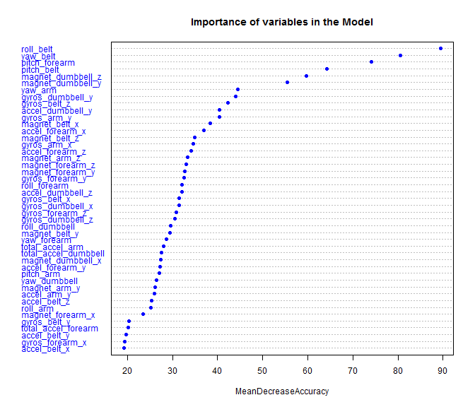
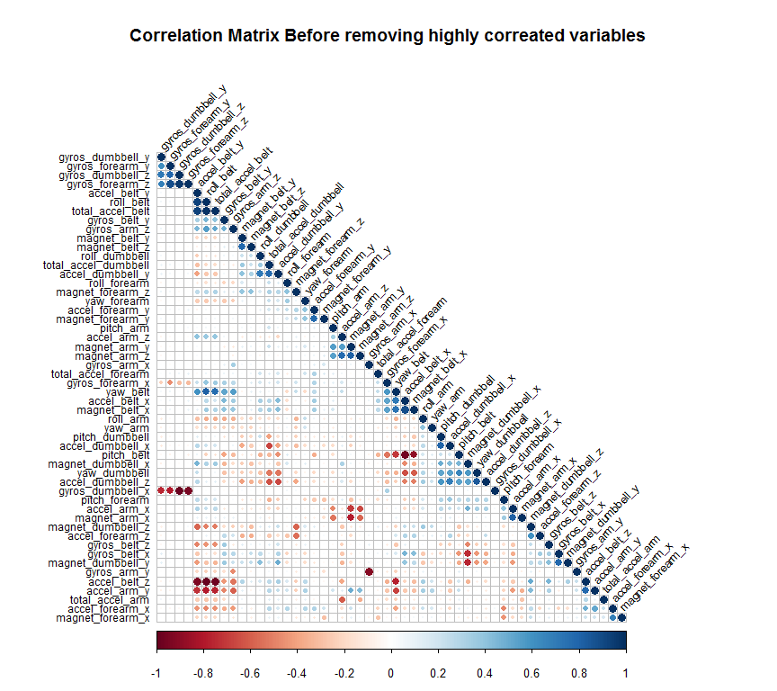
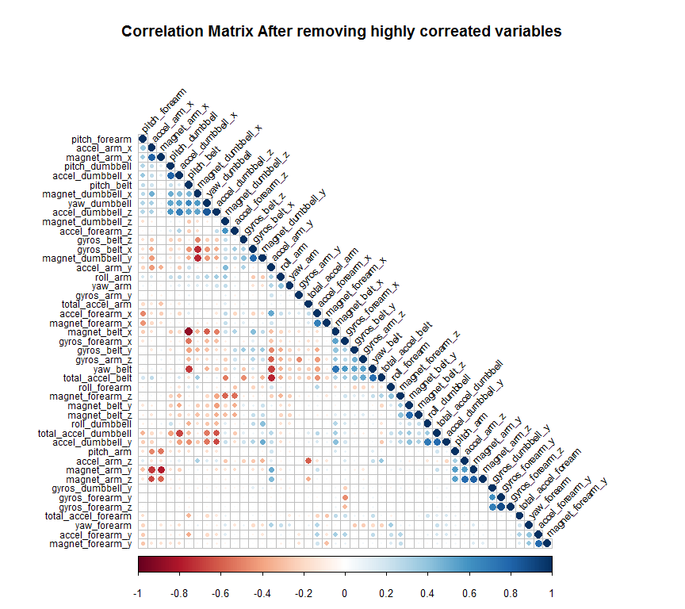
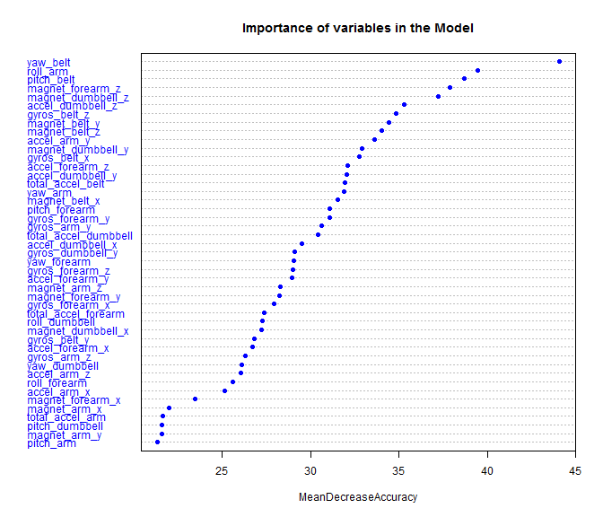

# Practical Machine Learning Assignment
UsamaFoad  
May, 2016  


## Introduction..

>"One thing that people regularly do is quantify how much of a particular activity they do, but they rarely quantify how well they do it. In this project, your goal will be to use data from accelerometers on the belt, forearm, arm, and dumbell of 6 participants."  

So, as in the instructions part of the project, the goal was to predict the manner in which these 6 participants did the exercise. i.e., use any variables in the dataset to predict the 'classe' variable which include five different groups (A, B, C, D, E).  

The training data for this project are available [here](https://d396qusza40orc.cloudfront.net/predmachlearn/pml-training.csv) and the test data are available [here](https://d396qusza40orc.cloudfront.net/predmachlearn/pml-testing.csv). It is important to notice that this ***test*** data is test for the assignment itself! Such name can make a big confusion, so, from now onwards I'll call this data ***pml-testing***, and it will not be used until the very end of the project.

###Exploring project dataset
The dataset consists of 19622 observation of 160 variables. One hundred of this variables containing many missing values. I created a simple *for* loop to cycle throughout the dataset to detect these variables with NA as first value. All these non completed variables was dropped. The first seven variable of the remaining 60, are either names, serial numbers or time-data. Names and serial numbers are not needed in prediction so it was dropped. Although, the useful of time-data in the analysis, but it needs to be analysed as 'chunks' that can make the prediction model more complicated and processing consume. So, I dropped this data too to start from simplest model first. And as I get accuracy of 98% with the remaining variables I did not need to use this data.  
The dataset was divided into three groups, training, testing and validation with ratio of 60:20:20, respectively.  

```r
# loading needed library
library(knitr) 
library(caret)
library(corrplot)
library(verification)
library(randomForest)
library(rpart)
library(mlbench)
library(rpart.plot)
library(RColorBrewer)
library(party)
library(mvtnorm)
library(modeltools)
library(stats4)
```


```r
# Load training and pml-testing dataset. N.B pml-testing is not testing for the model, it is
# testing for the assignment. I'll not use pml-testing until the very end of the project.
pml_testing <- read.csv("pml-testing.csv", na.strings=c("NA","")) 
training_data <- read.csv("pml-training.csv", na.strings=c("NA",""))
# part of the dataset showing the variables with NA
kable(head(training_data[10:15]))
```


 yaw_belt   total_accel_belt  kurtosis_roll_belt   kurtosis_picth_belt   kurtosis_yaw_belt   skewness_roll_belt 
---------  -----------------  -------------------  --------------------  ------------------  -------------------
    -94.4                  3  NA                   NA                    NA                  NA                 
    -94.4                  3  NA                   NA                    NA                  NA                 
    -94.4                  3  NA                   NA                    NA                  NA                 
    -94.4                  3  NA                   NA                    NA                  NA                 
    -94.4                  3  NA                   NA                    NA                  NA                 
    -94.4                  3  NA                   NA                    NA                  NA                 

```r
# If the first cell of the column is NA I'll drop it, there are 100 column almost empty
Not_Na_col_testing <- as.logical()
for (i in 1:length(pml_testing)) {
    if (!is.na(pml_testing[1,i])){
        Not_Na_col_testing <- c(Not_Na_col_testing, TRUE)
    }
    else{
        Not_Na_col_testing <- c(Not_Na_col_testing, FALSE)
    }
}

Not_Na_col_training <- as.logical()
for (i in 1:length(training_data)) {
    if (!is.na(training_data[1,i])){
        Not_Na_col_training <- c(Not_Na_col_training, TRUE)
    }
    else{
        Not_Na_col_training <- c(Not_Na_col_training, FALSE)
    }
}

# Make sure the empty columns is the same in both dataset
summary(Not_Na_col_training == Not_Na_col_testing)
```

```
##    Mode    TRUE    NA's 
## logical     160       0
```

```r
# Keep only the real data columns
pml_testing <- pml_testing[,Not_Na_col_testing]
training_data<- training_data[,Not_Na_col_training]

# Remove first 7 columns with time, names or time-data
pml_testing <- pml_testing[,-c(1:7)]
training_data<- training_data[,-c(1:7)]

set.seed(1424)
inTrain <- createDataPartition(training_data$classe, p=0.8, list=FALSE)
training_and_test <- training_data[inTrain,]
validation <- training_data[-inTrain,]
set.seed(1424)
# We need 60% from the original dataset so set p =0.75 (6/8*100)
inTrainTwo <- createDataPartition(training_and_test$classe, p=0.75, list=FALSE)
training <- training_and_test[inTrainTwo,]
testing <- training_and_test[-inTrainTwo,]
```

#Model Creation (First Round)  

At first I used [caret](https://cran.r-project.org/web/packages/caret/index.html) package to fit predictive cross validation model with random fores and conditional inference tree. Then I used those models on testing and validation dataset to predict the in- and out-sample errors and calculated the confusion matrix and its statistics.
I tried to did some scaling and normalization for the dataset without improve on performance, so i dropped this part from the report and I used the data as it is without transformation.  

Random forst **accuracy** was over 99% in both testing and validation dataset, with about 98% **sensitivity** and 99% **specificity**. Also, Kappa was 0.99. In the same time **No Information Rate** (*the proportion of classes that you would guess right if you randomly allocated them.*) was about 0.28. It is a great results, but still did not guarantee reasonable rate of out of sample error.
Variable importance for the random forst showed that *roll_belt*, *pitch_belt*, *yaw_belt*, *pitch_forearm*, *magnet_dumbbell_z* and *magnet_dumbbell_y* were the top important variables across the classes.

The best model accorss the conditional tree showed 91% accuracy with 0.89 Kappa. The confusion matrix showed that accuracy was about 88% with 0.85 Kappa. Sensitivity ranged from 81% to 94% between different classes, while specificity was ranging between 95% and 97%. 
The following code show these models


```r
start_Time <- Sys.time()
set.seed(1424)
train_control<-trainControl(method="cv", number=6, allowParallel=TRUE,savePredictions = TRUE, verboseIter=FALSE)

set.seed(1424)
RandomForestFit<-train(classe~.,data=training, method="rf", trControl=train_control, importance=TRUE)

predRandomForest_t<-predict(RandomForestFit, newdata=testing)
confusionMatrix(predRandomForest_t, testing$classe)
```

```
## Confusion Matrix and Statistics
## 
##           Reference
## Prediction    A    B    C    D    E
##          A 1116    6    0    0    0
##          B    0  748    4    0    0
##          C    0    5  680   10    0
##          D    0    0    0  632    2
##          E    0    0    0    1  719
## 
## Overall Statistics
##                                           
##                Accuracy : 0.9929          
##                  95% CI : (0.9897, 0.9953)
##     No Information Rate : 0.2845          
##     P-Value [Acc > NIR] : < 2.2e-16       
##                                           
##                   Kappa : 0.991           
##  Mcnemar's Test P-Value : NA              
## 
## Statistics by Class:
## 
##                      Class: A Class: B Class: C Class: D Class: E
## Sensitivity            1.0000   0.9855   0.9942   0.9829   0.9972
## Specificity            0.9979   0.9987   0.9954   0.9994   0.9997
## Pos Pred Value         0.9947   0.9947   0.9784   0.9968   0.9986
## Neg Pred Value         1.0000   0.9965   0.9988   0.9967   0.9994
## Prevalence             0.2845   0.1935   0.1744   0.1639   0.1838
## Detection Rate         0.2845   0.1907   0.1733   0.1611   0.1833
## Detection Prevalence   0.2860   0.1917   0.1772   0.1616   0.1835
## Balanced Accuracy      0.9989   0.9921   0.9948   0.9911   0.9985
```

```r
predRandomForest_v<-predict(RandomForestFit, newdata=validation)
confusionMatrix(predRandomForest_v, validation$classe)
```

```
## Confusion Matrix and Statistics
## 
##           Reference
## Prediction    A    B    C    D    E
##          A 1114    5    0    0    0
##          B    1  751    3    0    0
##          C    1    3  679    9    3
##          D    0    0    2  634    3
##          E    0    0    0    0  715
## 
## Overall Statistics
##                                           
##                Accuracy : 0.9924          
##                  95% CI : (0.9891, 0.9948)
##     No Information Rate : 0.2845          
##     P-Value [Acc > NIR] : < 2.2e-16       
##                                           
##                   Kappa : 0.9903          
##  Mcnemar's Test P-Value : NA              
## 
## Statistics by Class:
## 
##                      Class: A Class: B Class: C Class: D Class: E
## Sensitivity            0.9982   0.9895   0.9927   0.9860   0.9917
## Specificity            0.9982   0.9987   0.9951   0.9985   1.0000
## Pos Pred Value         0.9955   0.9947   0.9770   0.9922   1.0000
## Neg Pred Value         0.9993   0.9975   0.9985   0.9973   0.9981
## Prevalence             0.2845   0.1935   0.1744   0.1639   0.1838
## Detection Rate         0.2840   0.1914   0.1731   0.1616   0.1823
## Detection Prevalence   0.2852   0.1925   0.1772   0.1629   0.1823
## Balanced Accuracy      0.9982   0.9941   0.9939   0.9922   0.9958
```

```r
end_Time <- Sys.time()

round(end_Time - start_Time,2)
```

```
## Time difference of 16.72 mins
```

```r
varImp(RandomForestFit)
```

```
## rf variable importance
## 
##   variables are sorted by maximum importance across the classes
##   only 20 most important variables shown (out of 52)
## 
##                       A     B     C     D      E
## roll_belt         72.46 78.10 77.91 64.79 100.00
## pitch_belt        29.00 99.55 58.87 48.48  42.97
## pitch_forearm     61.21 73.10 88.02 58.50  61.35
## yaw_belt          73.24 62.09 64.04 71.45  43.05
## magnet_dumbbell_z 69.55 54.64 68.06 52.72  53.15
## magnet_dumbbell_y 60.93 53.75 68.12 54.07  47.18
## accel_forearm_x   19.32 37.05 33.42 50.64  36.16
## yaw_arm           42.40 30.37 31.31 29.59  19.44
## roll_forearm      40.87 30.88 35.74 23.97  28.04
## accel_dumbbell_y  28.57 29.53 36.52 27.35  28.80
## gyros_belt_z      23.69 28.83 31.49 19.43  34.41
## gyros_dumbbell_y  33.72 25.57 32.39 23.81  18.33
## magnet_belt_z     21.59 32.36 19.83 28.04  26.12
## roll_dumbbell     20.98 31.58 23.10 25.30  27.87
## accel_dumbbell_z  20.97 24.58 21.69 25.12  29.15
## gyros_arm_y       23.76 28.12 20.07 25.21  14.96
## magnet_forearm_z  27.32 26.72 23.39 24.65  27.66
## magnet_belt_y     15.30 27.11 24.89 19.39  26.16
## magnet_belt_x     12.36 27.02 24.05 14.51  22.71
## yaw_dumbbell      11.17 26.35 17.29 17.50  20.13
```


```r
start_Time <- Sys.time()
set.seed(1424)

train <- createFolds(training$classe, k=10)

ctreeFit <- train(classe ~ ., method = "ctree", data = training,
                  tuneLength = 5,
                  trControl = trainControl(
                      method = "cv", indexOut = train))
ctreeFit
```

```
## Conditional Inference Tree 
## 
## 11776 samples
##    52 predictor
##     5 classes: 'A', 'B', 'C', 'D', 'E' 
## 
## No pre-processing
## Resampling: Cross-Validated (10 fold) 
## Summary of sample sizes: 10599, 10599, 10597, 10597, 10599, 10599, ... 
## Resampling results across tuning parameters:
## 
##   mincriterion  Accuracy   Kappa    
##   0.010         0.9176292  0.8957974
##   0.255         0.9174594  0.8955780
##   0.500         0.9172051  0.8952530
##   0.745         0.9149984  0.8924336
##   0.990         0.9030248  0.8772304
## 
## Accuracy was used to select the optimal model using  the largest value.
## The final value used for the model was mincriterion = 0.01.
```

```r
predCtree_t<-predict(ctreeFit, newdata=testing)
confusionMatrix(predCtree_t, testing$classe)
```

```
## Confusion Matrix and Statistics
## 
##           Reference
## Prediction    A    B    C    D    E
##          A 1053   38    6   12    7
##          B   42  636   28   35   32
##          C    5   37  618   25   18
##          D   13   24   22  553   29
##          E    3   24   10   18  635
## 
## Overall Statistics
##                                           
##                Accuracy : 0.8909          
##                  95% CI : (0.8807, 0.9005)
##     No Information Rate : 0.2845          
##     P-Value [Acc > NIR] : <2e-16          
##                                           
##                   Kappa : 0.862           
##  Mcnemar's Test P-Value : 0.3256          
## 
## Statistics by Class:
## 
##                      Class: A Class: B Class: C Class: D Class: E
## Sensitivity            0.9435   0.8379   0.9035   0.8600   0.8807
## Specificity            0.9776   0.9567   0.9738   0.9732   0.9828
## Pos Pred Value         0.9435   0.8228   0.8791   0.8627   0.9203
## Neg Pred Value         0.9776   0.9610   0.9795   0.9726   0.9734
## Prevalence             0.2845   0.1935   0.1744   0.1639   0.1838
## Detection Rate         0.2684   0.1621   0.1575   0.1410   0.1619
## Detection Prevalence   0.2845   0.1970   0.1792   0.1634   0.1759
## Balanced Accuracy      0.9606   0.8973   0.9386   0.9166   0.9318
```

```r
predCtree_v<-predict(ctreeFit, newdata=validation)
confusionMatrix(predCtree_v, validation$classe)
```

```
## Confusion Matrix and Statistics
## 
##           Reference
## Prediction    A    B    C    D    E
##          A 1043   44   10   11    5
##          B   38  621   30   32   28
##          C   10   40  616   30   10
##          D   21   19   15  556   26
##          E    4   35   13   14  652
## 
## Overall Statistics
##                                           
##                Accuracy : 0.8891          
##                  95% CI : (0.8789, 0.8988)
##     No Information Rate : 0.2845          
##     P-Value [Acc > NIR] : <2e-16          
##                                           
##                   Kappa : 0.8598          
##  Mcnemar's Test P-Value : 0.0519          
## 
## Statistics by Class:
## 
##                      Class: A Class: B Class: C Class: D Class: E
## Sensitivity            0.9346   0.8182   0.9006   0.8647   0.9043
## Specificity            0.9751   0.9595   0.9722   0.9753   0.9794
## Pos Pred Value         0.9371   0.8291   0.8725   0.8728   0.9081
## Neg Pred Value         0.9740   0.9565   0.9789   0.9735   0.9785
## Prevalence             0.2845   0.1935   0.1744   0.1639   0.1838
## Detection Rate         0.2659   0.1583   0.1570   0.1417   0.1662
## Detection Prevalence   0.2837   0.1909   0.1800   0.1624   0.1830
## Balanced Accuracy      0.9548   0.8889   0.9364   0.9200   0.9418
```

```r
end_Time <- Sys.time()

round(end_Time - start_Time,2)
```

```
## Time difference of 2.83 mins
```


```r
varImpPlot(RandomForestFit$finalModel, main = "Importance of variables in the Model", 
           pch=19, col="blue",cex=0.75, sort=TRUE, type=1,n.var=45)
```



#Model Creation (Second Round)  
To avoid [Multicollinearity](https://en.wikipedia.org/wiki/Multicollinearity) problems the correlation was tested among variables and highly correlated variables ( >= 0.9) was removed. That did not suppose to improve the predictive power or reliability much (if at all!) but it improve calculation regarding  individual predictors and, hopefully, reduce out of sample errors.

The correlation matrix was calculated and the highly correlated variables (with correlation >= 0.9) was removed. Seven variables was highly correlated. The correlation matrix was plot before and after removing highly correlated variables. 
(N.B. some variables lock like it have highly correlation ex. magnet_belt_x and pitch_belt, in fact the correlation between these two variable is -0.882 and that less than the cut off criteria)  
Random forest and conditional inference tree were repeated on training dataset after removing the highly correlated variables. The results showed slightly improvement in accuracy, sensitivity, specificity and time to generate the model.

The following code shows these results.


```r
# calculate correlation matrix
correlationMatrix <- cor(training[,1:52])

# Find highly correlated variables >= 0.9
highlyCorrelatedNames <- findCorrelation(correlationMatrix, cutoff=0.9, names = TRUE)

# print highly correlated variable names
print(highlyCorrelatedNames)
```

```
## [1] "accel_belt_z"     "roll_belt"        "accel_belt_y"    
## [4] "accel_belt_x"     "gyros_dumbbell_x" "gyros_dumbbell_z"
## [7] "gyros_arm_x"
```

```r
# Calculate % of higlly correlated variables
round(length(highlyCorrelatedNames)/52*100, 2)
```

```
## [1] 13.46
```


```r
corrplot(correlationMatrix, method = "circle", type="lower",  title = "Correlation Matrix Before removing highly correated variables", mar = c(0, 0, 4, 0),tl.cex = 0.75, order="hclust", hclust.method = "complete", tl.col="black", tl.srt = 45)
```




```r
training <-  training[,!names(training) %in% highlyCorrelatedNames]
testing <- testing[,!names(testing) %in% highlyCorrelatedNames]
validation <- validation[,!names(testing) %in% highlyCorrelatedNames]
# calculate correlation matrix
correlationMatrix <- cor(training[,1:45])

# Find highly correlated variables >= 0.9
highlyCorrelatedNames <- findCorrelation(correlationMatrix, cutoff=0.9, names = TRUE)

# print highly correlated variable names
print(highlyCorrelatedNames)
```

```
## character(0)
```

```r
# Calculate % of higlly correlated variables
round(length(highlyCorrelatedNames)/45*100, 2)
```

```
## [1] 0
```


```r
corrplot(correlationMatrix, method = "circle", type="lower",  title = "Correlation Matrix After removing highly correated variables", mar = c(0, 0, 4, 0),tl.cex = 0.75, order="hclust", hclust.method = "complete", tl.col="black", tl.srt = 45)
```




```r
start_Time <- Sys.time()
set.seed(1424)
train_control<-trainControl(method="cv", number=6, allowParallel=TRUE,savePredictions = TRUE, verboseIter=FALSE)

set.seed(1424)
RandomForestFit<-train(classe~.,data=training, method="rf", trControl=train_control, importance=TRUE)

predRandomForest_t<-predict(RandomForestFit, newdata=testing)
confusionMatrix(predRandomForest_t, testing$classe)
```

```
## Confusion Matrix and Statistics
## 
##           Reference
## Prediction    A    B    C    D    E
##          A 1116    5    0    0    0
##          B    0  754    3    0    0
##          C    0    0  681   13    0
##          D    0    0    0  626    1
##          E    0    0    0    4  720
## 
## Overall Statistics
##                                           
##                Accuracy : 0.9934          
##                  95% CI : (0.9903, 0.9957)
##     No Information Rate : 0.2845          
##     P-Value [Acc > NIR] : < 2.2e-16       
##                                           
##                   Kappa : 0.9916          
##  Mcnemar's Test P-Value : NA              
## 
## Statistics by Class:
## 
##                      Class: A Class: B Class: C Class: D Class: E
## Sensitivity            1.0000   0.9934   0.9956   0.9736   0.9986
## Specificity            0.9982   0.9991   0.9960   0.9997   0.9988
## Pos Pred Value         0.9955   0.9960   0.9813   0.9984   0.9945
## Neg Pred Value         1.0000   0.9984   0.9991   0.9948   0.9997
## Prevalence             0.2845   0.1935   0.1744   0.1639   0.1838
## Detection Rate         0.2845   0.1922   0.1736   0.1596   0.1835
## Detection Prevalence   0.2858   0.1930   0.1769   0.1598   0.1846
## Balanced Accuracy      0.9991   0.9962   0.9958   0.9866   0.9987
```

```r
predRandomForest_v<-predict(RandomForestFit, newdata=validation)
confusionMatrix(predRandomForest_v, validation$classe)
```

```
## Confusion Matrix and Statistics
## 
##           Reference
## Prediction    A    B    C    D    E
##          A 1114    4    0    0    0
##          B    1  754    3    0    0
##          C    1    1  681   18    1
##          D    0    0    0  624    1
##          E    0    0    0    1  719
## 
## Overall Statistics
##                                           
##                Accuracy : 0.9921          
##                  95% CI : (0.9888, 0.9946)
##     No Information Rate : 0.2845          
##     P-Value [Acc > NIR] : < 2.2e-16       
##                                           
##                   Kappa : 0.99            
##  Mcnemar's Test P-Value : NA              
## 
## Statistics by Class:
## 
##                      Class: A Class: B Class: C Class: D Class: E
## Sensitivity            0.9982   0.9934   0.9956   0.9705   0.9972
## Specificity            0.9986   0.9987   0.9935   0.9997   0.9997
## Pos Pred Value         0.9964   0.9947   0.9701   0.9984   0.9986
## Neg Pred Value         0.9993   0.9984   0.9991   0.9942   0.9994
## Prevalence             0.2845   0.1935   0.1744   0.1639   0.1838
## Detection Rate         0.2840   0.1922   0.1736   0.1591   0.1833
## Detection Prevalence   0.2850   0.1932   0.1789   0.1593   0.1835
## Balanced Accuracy      0.9984   0.9961   0.9946   0.9851   0.9985
```

```r
end_Time <- Sys.time()

round(end_Time - start_Time,2)
```

```
## Time difference of 14.52 mins
```

```r
varImp(RandomForestFit)
```

```
## rf variable importance
## 
##   variables are sorted by maximum importance across the classes
##   only 20 most important variables shown (out of 45)
## 
##                       A     B     C      D     E
## yaw_belt          94.42 81.77 76.46 100.00 55.86
## pitch_belt        63.94 95.28 57.73  69.65 66.60
## magnet_dumbbell_z 77.27 70.45 83.43  61.42 60.44
## roll_arm          40.00 79.80 74.99  62.23 63.43
## magnet_dumbbell_y 44.64 57.36 75.95  61.74 42.08
## magnet_forearm_z  47.34 75.34 63.60  64.16 55.34
## magnet_belt_y     39.97 64.09 58.25  68.30 54.25
## magnet_belt_z     48.05 55.38 54.61  68.16 57.00
## gyros_belt_z      40.43 64.89 58.65  50.19 57.39
## accel_dumbbell_z  51.36 63.51 59.80  55.60 58.99
## magnet_dumbbell_x 33.70 38.79 61.62  39.64 34.79
## accel_forearm_z   24.62 54.69 61.59  49.55 50.13
## magnet_belt_x     28.37 56.14 46.28  33.84 61.53
## gyros_arm_y       22.66 61.16 32.03  50.06 39.72
## accel_dumbbell_y  42.19 55.87 60.35  47.71 47.52
## accel_arm_y       30.82 60.01 43.14  44.48 52.35
## gyros_forearm_y   27.62 58.61 45.35  39.92 40.45
## yaw_arm           36.32 57.32 46.84  55.31 42.81
## pitch_forearm     36.11 55.97 45.67  55.81 47.76
## magnet_forearm_y  28.21 45.31 54.87  36.86 36.62
```


```r
start_Time <- Sys.time()
set.seed(1424)

train <- createFolds(training$classe, k=10)

ctreeFit <- train(classe ~ ., method = "ctree", data = training,
                  tuneLength = 5,
                  trControl = trainControl(
                      method = "cv", indexOut = train))
ctreeFit
```

```
## Conditional Inference Tree 
## 
## 11776 samples
##    45 predictor
##     5 classes: 'A', 'B', 'C', 'D', 'E' 
## 
## No pre-processing
## Resampling: Cross-Validated (10 fold) 
## Summary of sample sizes: 10599, 10599, 10597, 10597, 10599, 10599, ... 
## Resampling results across tuning parameters:
## 
##   mincriterion  Accuracy   Kappa    
##   0.010         0.9159327  0.8936307
##   0.255         0.9157628  0.8934144
##   0.500         0.9157632  0.8934102
##   0.745         0.9141508  0.8913509
##   0.990         0.9001385  0.8735442
## 
## Accuracy was used to select the optimal model using  the largest value.
## The final value used for the model was mincriterion = 0.01.
```

```r
predCtree_t<-predict(ctreeFit, newdata=testing)
confusionMatrix(predCtree_t, testing$classe)
```

```
## Confusion Matrix and Statistics
## 
##           Reference
## Prediction    A    B    C    D    E
##          A 1055   41    8   20    7
##          B   41  640   31   33   38
##          C    5   36  617   27   18
##          D   13   27   19  540   29
##          E    2   15    9   23  629
## 
## Overall Statistics
##                                          
##                Accuracy : 0.8873         
##                  95% CI : (0.877, 0.8971)
##     No Information Rate : 0.2845         
##     P-Value [Acc > NIR] : < 2e-16        
##                                          
##                   Kappa : 0.8574         
##  Mcnemar's Test P-Value : 0.02114        
## 
## Statistics by Class:
## 
##                      Class: A Class: B Class: C Class: D Class: E
## Sensitivity            0.9453   0.8432   0.9020   0.8398   0.8724
## Specificity            0.9729   0.9548   0.9734   0.9732   0.9847
## Pos Pred Value         0.9328   0.8174   0.8777   0.8599   0.9277
## Neg Pred Value         0.9782   0.9621   0.9792   0.9687   0.9716
## Prevalence             0.2845   0.1935   0.1744   0.1639   0.1838
## Detection Rate         0.2689   0.1631   0.1573   0.1376   0.1603
## Detection Prevalence   0.2883   0.1996   0.1792   0.1601   0.1728
## Balanced Accuracy      0.9591   0.8990   0.9377   0.9065   0.9285
```

```r
predCtree_v<-predict(ctreeFit, newdata=validation)
confusionMatrix(predCtree_v, validation$classe)
```

```
## Confusion Matrix and Statistics
## 
##           Reference
## Prediction    A    B    C    D    E
##          A 1056   51   10   19    9
##          B   31  633   31   27   33
##          C    7   35  617   32   11
##          D   21   19   14  546   25
##          E    1   21   12   19  643
## 
## Overall Statistics
##                                           
##                Accuracy : 0.8909          
##                  95% CI : (0.8807, 0.9005)
##     No Information Rate : 0.2845          
##     P-Value [Acc > NIR] : < 2.2e-16       
##                                           
##                   Kappa : 0.8619          
##  Mcnemar's Test P-Value : 0.007306        
## 
## Statistics by Class:
## 
##                      Class: A Class: B Class: C Class: D Class: E
## Sensitivity            0.9462   0.8340   0.9020   0.8491   0.8918
## Specificity            0.9683   0.9614   0.9738   0.9759   0.9834
## Pos Pred Value         0.9223   0.8384   0.8789   0.8736   0.9239
## Neg Pred Value         0.9784   0.9602   0.9792   0.9706   0.9758
## Prevalence             0.2845   0.1935   0.1744   0.1639   0.1838
## Detection Rate         0.2692   0.1614   0.1573   0.1392   0.1639
## Detection Prevalence   0.2919   0.1925   0.1789   0.1593   0.1774
## Balanced Accuracy      0.9573   0.8977   0.9379   0.9125   0.9376
```

```r
end_Time <- Sys.time()

round(end_Time - start_Time,2)
```

```
## Time difference of 2.41 mins
```


```r
varImpPlot(RandomForestFit$finalModel, main = "Importance of variables in the Model", 
           pch=19, col="blue",cex=0.75, sort=TRUE, type=1,n.var=45)
```



# Conclusion and Final Model selection
Random forest showed better results than conditional tree. Also, removing highly correlated variables improve the model slightly. So, that model was selected as the final model. In sample error is less than 1%, while the out of sample error is more difficult to estimate as the validation and testing dataset did not show big diffrence. The final model was applied on pml-testing data set and the results were supmited to Course Project Prediction. From the results showed by auto grader out of sample error estimated to be less than 1%.


```r
predict(RandomForestFit, newdata=pml_testing)
```

```
##  [1] B A B A A E D B A A B C B A E E A B B B
## Levels: A B C D E
```

```r
sessionInfo()
```

```
## R version 3.2.3 (2015-12-10)
## Platform: x86_64-w64-mingw32/x64 (64-bit)
## Running under: Windows >= 8 x64 (build 9200)
## 
## locale:
## [1] LC_COLLATE=English_United States.1252 
## [2] LC_CTYPE=English_United States.1252   
## [3] LC_MONETARY=English_United States.1252
## [4] LC_NUMERIC=C                          
## [5] LC_TIME=English_United States.1252    
## 
## attached base packages:
## [1] stats4    grid      stats     graphics  grDevices utils     datasets 
## [8] methods   base     
## 
## other attached packages:
##  [1] RColorBrewer_1.1-2  rpart.plot_1.5.3    rpart_4.1-10       
##  [4] party_1.0-25        strucchange_1.5-1   sandwich_2.3-4     
##  [7] zoo_1.7-13          modeltools_0.2-21   mvtnorm_1.0-5      
## [10] randomForest_4.6-12 verification_1.42   dtw_1.18-1         
## [13] proxy_0.4-15        CircStats_0.2-4     MASS_7.3-45        
## [16] boot_1.3-18         fields_8.4-1        maps_3.1.0         
## [19] spam_1.3-0          mlbench_2.1-1       corrplot_0.77      
## [22] caret_6.0-68        ggplot2_2.1.0       lattice_0.20-33    
## [25] knitr_1.13         
## 
## loaded via a namespace (and not attached):
##  [1] coin_1.1-2         reshape2_1.4.1     splines_3.2.3     
##  [4] colorspace_1.2-6   htmltools_0.3.5    yaml_2.1.13       
##  [7] mgcv_1.8-12        survival_2.39-4    nloptr_1.0.4      
## [10] multcomp_1.4-5     foreach_1.4.3      plyr_1.8.3        
## [13] stringr_1.0.0      MatrixModels_0.4-1 munsell_0.4.3     
## [16] gtable_0.2.0       codetools_0.2-14   evaluate_0.9      
## [19] SparseM_1.7        quantreg_5.24      pbkrtest_0.4-6    
## [22] parallel_3.2.3     TH.data_1.0-7      Rcpp_0.12.5       
## [25] scales_0.4.0       formatR_1.4        lme4_1.1-12       
## [28] digest_0.6.9       stringi_1.0-1      tools_3.2.3       
## [31] magrittr_1.5       car_2.1-2          Matrix_1.2-6      
## [34] minqa_1.2.4        rmarkdown_0.9.6    iterators_1.0.8   
## [37] nnet_7.3-12        nlme_3.1-128
```
#References  

[Building Predictive Models in R Using the caret Package](https://www.jstatsoft.org/article/view/v028i05/v28i05.pdf)

[Caret documentation](http://cran.r-project.org/web/packages/caret/caret.pdf)

[Model Training and Tuning](http://topepo.github.io/caret/training.html)

[Multicollinearity](https://en.wikipedia.org/wiki/Multicollinearity)

[Random Forests](https://www.stat.berkeley.edu/~breiman/RandomForests/cc_home.htm)

